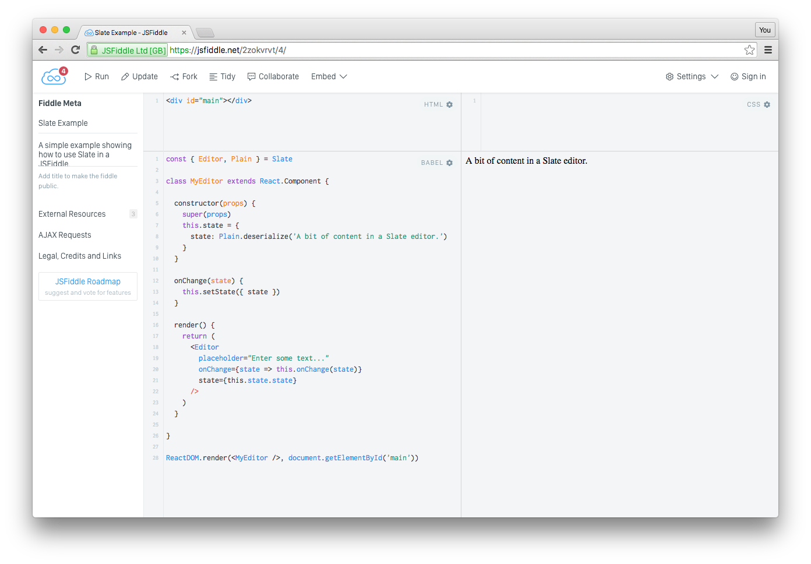
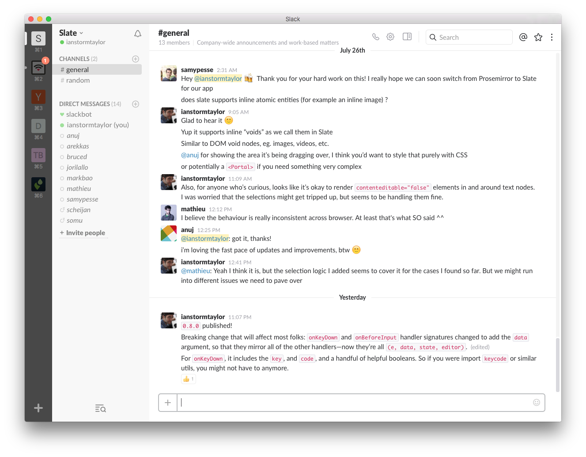

# Contributing

Want to contribute to Slate? That would be awesome!

- [Reporting Bugs](#reporting-bugs)
- [Asking Questions](#asking-questions)
- [Submitting Pull Requests](#submitting-pull-requests)
- [Repository Setup](#repository-setup)
- [Running Examples](#running-examples)
- [Running Tests](#running-tests)
- [Testing Input Methods](#testing-input-methods)
- [Publishing Releases](#publishing-releases)

## Reporting Bugs

If you run into any weird behavior while using Slate, feel free to open a new issue in this repository! Please run a **search before opening** a new issue, to make sure that someone else hasn't already reported or solved the bug you've found.

Any issue you open must include:

- A [JSFiddle](https://jsfiddle.net/01pLxfzu/) that reproduces the bug with a minimal setup.
- A GIF showing the issue in action. (Using something like [RecordIt](http://recordit.co/).)
- A clear explanation of what the issue is.

Here's a [JSFiddle template for Slate](https://jsfiddle.net/01pLxfzu/) to get you started:

[](https://jsfiddle.net/01pLxfzu/)

## Asking Questions

We've also got a [Slate Slack team](https://slate-slack.herokuapp.com) where you can ask questions and get answers from other people using Slate:

[](https://slate-slack.herokuapp.com)

Please use the Slack instead of asking questions in issues, since we want to reserve issues for keeping track of bugs and features. We close questions in issues so that maintaining the project isn't overwhelming.

## Submitting Pull Requests

All pull requests are super welcomed and greatly appreciated! Issues in need of a solution are marked with a [`♥ help`](https://github.com/ianstormtaylor/slate/issues?q=is%3Aissue+is%3Aopen+label%3A%22%E2%99%A5+help%22) label if you're looking for somewhere to start.

Please include tests and docs with every pull request!

## Repository Setup

The slate repository is a monorepo that is managed with [lerna](https://github.com/lerna/lerna). Unlike more traditional repositories, this means that the repository must be built in order for tests, linting, or other common development activities to function as expected.

To run the build, you need to have the Slate repository cloned to your computer. After that, you need to `cd` into the directory where you cloned it, and install the dependencies with `yarn` and build the monorepo:

```shell
yarn install
yarn build
```

## Running Examples

To run the examples, start by building the monorepo as described in the [Repository Setup](#repository-setup) section.

Then you can start the examples server with:

```shell
yarn start
```

## Running Tests

To run the tests, start by building the monorepo as described in the [Repository Setup](#repository-setup) section.

Then you can rerun the tests with:

```shell
yarn test
```

If you need to debug something, you can add a `debugger` line to the source, and then run `yarn test:inspect`.

If you only want to run a specific test or tests, you can run `yarn test --fgrep="slate-react rendering"` flag which will filter the tests being run by grepping for the string in each test. (This is a Mocha flag that gets passed through.)

## Testing Input Methods

[Here's a helpful page](https://github.com/Microsoft/vscode/wiki/IME-Test) detailing how to test various input scenarios on Windows, Mac and Linux.

## Publishing Releases

Since we use [Lerna](https://lerna.js.org) to manage the Slate packages this is fairly easy, just run:

```shell
yarn release:latest
```

And follow the prompts Lerna gives you.

Note that this will automatically run the prelease script first that will build, test and lint before attempting to publish.

## Publishing `@next` Releases

If we are unsure as to the stability of a release because there are significant changes and/or particularly complex changes, release with the `@next` tag.

```shell
yarn release:next
```

And follow the prompts Lerna gives you.

## Running Prerelease Script

If we want to make sure that Slate code follows the preparations for a release but without actually publishing, run:

```shell
yarn prerelease
```

Which will build, test and lint Slate code.
