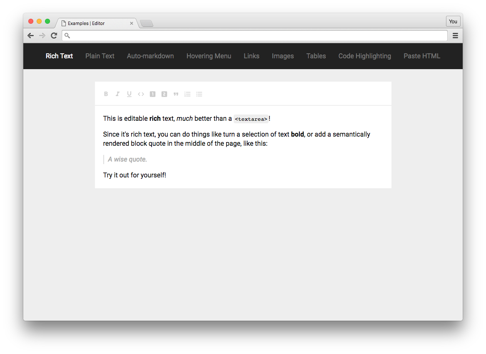

  

  A <em>completely</em> customizable framework  
  for building rich text editors.

 

  <a href="#why"><strong>Why?</strong></a> ·
  <a href="#principles"><strong>Principles</strong></a> ·
  <a href="http://slatejs.org"><strong>Demo</strong></a> ·
  <a href="#examples"><strong>Examples</strong></a> ·
  <a href="./docs/general/plugins.md"><strong>Plugins</strong></a> ·
  <a href="http://docs.slatejs.org"><strong>Documentation</strong></a> ·
  <a href="./Contributing.md"><strong>Contributing!</strong></a>

 

  

  
  
  

 

Slate lets you build rich, intuitive editors like those in [Medium](https://medium.com/), [Dropbox Paper](https://www.dropbox.com/paper) or [Google Docs](https://www.google.com/docs/about/)—which are becoming table stakes for applications on the web—without your codebase getting mired in complexity.

It can do this because all of its logic is implemented with a series of plugins, so you aren't ever constrained by what _is_ or _isn't_ in "core". You can think of it like a pluggable implementation of `contenteditable` built on top of [React](https://facebook.github.io/react/) and [Immutable](https://facebook.github.io/immutable-js/). It was inspired by libraries like [Draft.js](https://facebook.github.io/draft-js/), [Prosemirror](http://prosemirror.net/) and [Quill](http://quilljs.com/).

> 🤖 **Slate is currently in beta**. Its core API is useable now, but you might need to pull request a fix or two for advanced use cases. Some of its APIs are not "finalized" and will (breaking) change over time as we discover better solutions.

 

### Why?

Why create Slate? Well... _(Beware: this section has a few of [my](https://github.com/ianstormtaylor) opinions!)_

Before creating Slate, I tried a lot of the other rich text libraries out there—[**Draft.js**](https://facebook.github.io/draft-js/), [**Prosemirror**](http://prosemirror.net/), [**Quill**](http://quilljs.com/), etc. What I found was that while getting simple examples to work was easy enough, once you started trying to build something like [Medium](https://medium.com/), [Dropbox Paper](https://www.dropbox.com/paper) or [Google Docs](https://www.google.com/docs/about/), you ran into deeper issues...

* **The editor's "schema" was hardcoded and hard to customize.** Things like bold and italic were supported out of the box, but what about comments, or embeds, or even more domain-specific needs?

* **Transforming the documents programmatically was very convoluted.** Writing as a user may have worked, but making programmatic changes, which is critical for building advanced behaviors, was needlessly complex.

* **Serializing to HTML, Markdown, etc. seemed like an afterthought.** Simple things like transforming a document to HTML or Markdown involved writing lots of boilerplate code, for what seemed like very common use cases.

* **Re-inventing the view layer seemed inefficient and limiting.** Most editors rolled their own views, instead of using existing technologies like React, so you have to learn a whole new system with new "gotchas".

* **Collaborative editing wasn't designed for in advance.** Often the editor's internal representation of data made it impossible to use to for a realtime, collaborative editing use case without basically rewriting the editor.

* **The repositories were monolithic, not small and reusable.** The code bases for many of the editors often didn't expose the internal tooling that could have been re-used by developers, leading to having to reinvent the wheel.

* **Building complex, nested documents was impossible.** Many editors were designed around simplistic "flat" documents, making things like tables, embeds and captions difficult to reason about and sometimes impossible.

Of course not every editor exhibits all of these issues, but if you've tried using another editor you might have run into similar problems. To get around the limitations of their API's and achieve the user experience you're after, you have to resort to very hacky things. And some experiences are just plain impossible to achieve.

If that sounds familiar, you might like Slate.

Which brings me to how Slate solves all of that...

 

### Principles

Slate tries to solve the question of "[Why?](#why)" with a few principles:

1. **First-class plugins.** The most important part of Slate is that plugins are first-class entities—the core editor logic is even implemented as its own plugin. That means you can _completely_ customize the editing experience, to build complex editors like Medium's or Dropbox's, without having to fight against the library's assumptions.

2. **Schema-less core.** Slate's core logic doesn't assume anything about the schema of the data you'll be editing, which means that there are no assumptions baked into the library that'll trip you up when you need to go beyond the most basic use cases.

3. **Nested document model.** The document model used for Slate is a nested, recursive tree, just like the DOM itself. This means that creating complex components like tables or nested block quotes are possible for advanced use cases. But it's also easy to keep it simple by only using a single level of hierarchy.

4. **Parallel to the DOM.** Slate's data model is based on the DOM—the document is a nested tree, it uses selections and ranges, and it exposes all the standard event handlers. This means that advanced behaviors like tables or nested block quotes are possible. Pretty much anything you can do in the DOM, you can do in Slate.

5. **Stateless views and immutable data.** By using React and Immutable.js, the Slate editor is built in a stateless fashion using immutable data structures, which leads to much easier to reason about code, and a much easier time writing plugins.

6. **Intuitive changes.** Slate documents are edited using "changes", that are designed to be high-level and extremely intuitive to write and read, so that custom functionality is as expressive as possible. This greatly increases your ability to reason about your code.

7. **Collaboration-ready data model.** The data model Slate uses—specifically how changes are applied to the document—has been designed to allow for collaborative editing to be layered on top, so you won't need to rethink everything if you decide to make your editor collaborative.

8. **Clear "core" boundaries.** With a plugin-first architecture, and a schema-less core, it becomes a lot clearer where the boundary is between "core" and "custom", which means that the core experience doesn't get bogged down in edge cases.

 

### Demo

Check out the [**live demo**](http://slatejs.org) of all of the examples!

 

### Examples

To get a sense for how you might use Slate, check out a few of the examples:

* [**Plain text**](./examples/plain-text) — showing the most basic case: a glorified `<textarea>`.
* [**Rich text**](./examples/rich-text) — showing the features you'd expect from a basic editor.
* [**Auto-markdown**](./examples/markdown-shortcuts) — showing how to add key handlers for Markdown-like shortcuts.
* [**Links**](./examples/links) — showing how wrap text in inline nodes with associated data.
* [**Images**](./examples/images) — showing how to use void (text-less) nodes to add images.
* [**Hovering menu**](./examples/hovering-menu) — showing how a contextual hovering menu can be implemented.
* [**Tables**](./examples/tables) — showing how to nest blocks to render more advanced components.
* [**Paste HTML**](./examples/paste-html) — showing how to use an HTML serializer to handle pasted HTML.
* [**Code Highlighting**](./examples/code-highlighting) — showing how to use decorations to dynamically mark text.
* [**See all the examples...**](./examples)

If you have an idea for an example that shows a common use case, pull request it!

 

### Plugins

Slate encourages you to write small, reusable modules. Check out the public ones you can use in your project!

* [`slate-auto-replace`](https://github.com/ianstormtaylor/slate-plugins/tree/master/packages/slate-auto-replace) auto-replaces text as the user types. Useful for "smart" typography!
* [`slate-collapse-on-escape`](https://github.com/ianstormtaylor/slate-plugins/tree/master/packages/slate-collapse-on-escape) simply collapses the selection when `escape` is pressed.
* [`slate-edit-code`](https://github.com/GitbookIO/slate-edit-code) adds code editing behavior like tab-to-indent, and enter-to-soft-break.
* [`slate-edit-list`](https://github.com/GitbookIO/slate-edit-list) adds rich, nested list editing behavior.
* [`slate-edit-table`](https://github.com/GitbookIO/slate-edit-table) adds complex table editing behavior!
* [`slate-paste-linkify`](https://github.com/ianstormtaylor/slate-plugins/tree/master/packages/slate-paste-linkify) wraps the selected text in a link when a URL is pasted from the clipboard.
* [`slate-prism`](https://github.com/GitbookIO/slate-prism) highlights code blocks with [Prism.js](http://prismjs.com/)!
* [`slate-soft-break`](https://github.com/ianstormtaylor/slate-plugins/tree/master/packages/slate-soft-break) adds a soft break when `enter` is pressed.
* [`slate-drop-or-paste-images`](https://github.com/ianstormtaylor/slate-plugins/tree/master/packages/slate-drop-or-paste-images) lets users drop or paste images to insert them!
* [**See all the plugins...**](./docs/general/plugins.md)

 

### Documentation

If you're using Slate for the first time, check out the [Getting Started](http://docs.slatejs.org/walkthroughs/installing-slate) walkthroughs and the [Guides](http://docs.slatejs.org/guides) to familiarize yourself with Slate's architecture and mental models. Once you've gotten familiar with those, you'll probably want to check out the full [API Reference](http://docs.slatejs.org/slate-core).

* [**Walkthroughs**](http://docs.slatejs.org/walkthroughs/installing-slate)
* [**Guides**](http://docs.slatejs.org/guides)
* [**Reference**](http://docs.slatejs.org/slate-core)
* [**FAQ**](http://docs.slatejs.org/general/faq)
* [**Resources**](http://docs.slatejs.org/general/resources)

If even that's not enough, you can always [read the source itself](./packages/slate), which is heavily commented.

There are also translations of the documentation into other languages:

* [中文](https://doodlewind.github.io/slate-doc-cn/)

If you're maintaining a translation, feel free to pull request it here!

 

### Packages

Slate's codebase is monorepo managed with [Lerna](https://lernajs.io/). It consists of a handful of packages—although you won't always use all of them. They are:

| **Package**                                            | **Version**                                                                                                                                     | **Size**                                                                                                                                                                                                                | **Description**                                     |
| ------------------------------------------------------ | ----------------------------------------------------------------------------------------------------------------------------------------------- | ----------------------------------------------------------------------------------------------------------------------------------------------------------------------------------------------------------------------- | --------------------------------------------------- |
| [`slate`](./slate)                                     |                                      |                                                                          | Slate's core data model logic.                      |
| [`slate-base64-serializer`](./slate-base64-serializer) |  |  | A Base64 string serializer for Slate documents.     |
| [`slate-html-serializer`](./slate-html-serializer)     |      |          | An HTML serializer for Slate documents.             |
| [`slate-hyperscript`](./slate-hyperscript)             |              |                          | A hyperscript tool to write JSX Slate documents!    |
| [`slate-plain-serializer`](./slate-plain-serializer)   |    |      | A plain text serializer for Slate documents.        |
| [`slate-prop-types`](./slate-prop-types)               |                |                              | React prop types for checking Slate values.         |
| [`slate-react`](./slate-react)                         |                          |                                                  | React components for rendering Slate editors.       |
| [`slate-hotkeys`](./slate-hotkeys)                     |                      |                                          | Detect common keypresses in a platform-agnostic way |

 

### Contributing!

All contributions are super welcome! Check out the [Contributing instructions](./Contributing.md) for more info!

Slate is [MIT-licensed](./License.md).
