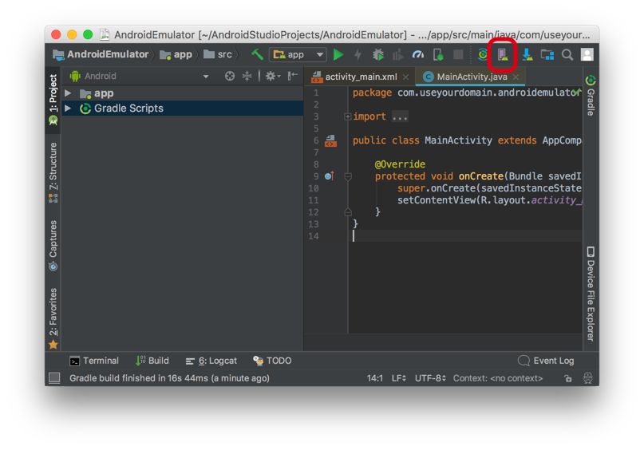

# Android Development Guide

## Supported Browser Targets

The goal is to have full coverage against all modern Android versions against all devices; however, we select a reasonable subset which we believe will have a high likelihood of full interoperability across modern devices.

The following Android versions are targeted.

*   Android 6.0
*   Android 7.1

## Development Setup Overview

To work on Slate with Android, we recommend using the official integrated develpment environment for Google's Android operating system which is available on Windows, Mac and Linux.

## Installation

### Warning: State of Android Studio

At time of writing, Android Studio does not _just work_ out of the box like a typical application. Expect to go through a process which can be difficult if you've never used Android Studio before; however, with this development guide you should be able to get through this process as quickly as possible.

### Download and Install Android Studio

Download and install Android Studio from here:

[Android Studio Download](https://developer.android.com/studio/index.html)

Start downloading Android Studio by clicking the installation button on the web page. This is the button for a Mac. Your button may look slightly different.

After clicking you will be redirected to an instruction page on how to **Install Android Studio**. Follow the process but:

**IMPORTANT!** During the installation process, do a custom install instead of the default installation.

Select "Custom" when choosing the "Install Type"

After selecting **Install Type** you will be asked to **Select UI Theme**. Choose the one you prefer.

Next, at the SDK Components Setup, make sure to select **Android Virtual Device**. Also **Performance (Intel HAXM)** should be selected already but if not, make sure to select it.

Make sure everything is checked here

Complete the rest of the installation process. There are no other special changes required.

It may take some time to complete the installation process.

During the installation process, you may get a request for security credentials. This is normal.

On a Mac, you may get a warning **System Extension Blocked**

When you do, click **Open Security Preferences** and in the **Security & Privacy** window that opens up, click the **Allow** buton next to the text **System Software from developer "Intel Corporation Apps" was blocked from loading**.

## Setup Android Studio for Emulation

### Start a Project

In order to access the emulator, we are going to setup an Android Studio project and launch the emulator from there. There are other ways that don't require creating an Android Studio project but for now we haven't documented these methods.

After the installation process completes, select **Start a new Android Studio project** from the **Welcome to Android Studio** window.

Select "Start a new Android Studio project"

A Create Android Project window pops up. The information about your project isn't that important. We've used for **Application name** the name `Android Emulator` but you can name it whatever you like. You should enter your own **Company domain**.

You can complete the rest of the steps using the defaults.

Once you have completed the steps, it will take some time to build the project.

### Configuring and Using Android Virtual Device Manager

Once your project is ready, you should see the project window.

There are two ways to open the Android Virtual Device Manager.

* Click the AVD Manager Icon in the interface (see higlighted item in screenshot below)

* Or select **Tools** \> **AVD Manager** from the menu

This will launch AVD Manager

By default, there is a virtual device. Click the green triangle pointing right to start the emulator.

This will launch the emulator. Click the **Chrome** icon to launch the browser.

Use the browser to access Slate. For now, try navigating to slatejs.org:

### Adding More Virtual Devices

Click **\+ Create Virtual Device** from Android Virtual Device Manager to add more devices. This includes the ability to select an installed Android version.

For consistency, we are recommending installing virtual devices for:

*   Nexus 5X with Android 8.1
*   Nexus 5X with Android 7.1.1
*   Nexus 4 with Android 6.0

### Android Virtual Device Manager issues

Inside Android Studio, you are supposed to be able to access **AVD Manager** if it is installed but sometimes it may be missing from the menu and the AVD Manager icon is disabled.

The most common cause for this is that the Intel Hardware Accelerated Execution Manager (HAXM) was not installed properly.

Note: Android Studio **Preferences** may show that **Appearances & Behavior** \> **System Settings** \> **Intel x86 Emulator Accelrator (HAXM installer)** is marked as installed when in fact HAXM is not installed. This setting in ambiguoulsy indicates that the _installer_ is installed, not that HAXM itself is installed.

We recommend installing from the official Intel Download to be sure if you are having this problem:

[https://software.intel.com/en-us/articles/intel-hardware-accelerated-execution-manager-intel-haxm](https://software.intel.com/en-us/articles/intel-hardware-accelerated-execution-manager-intel-haxm)