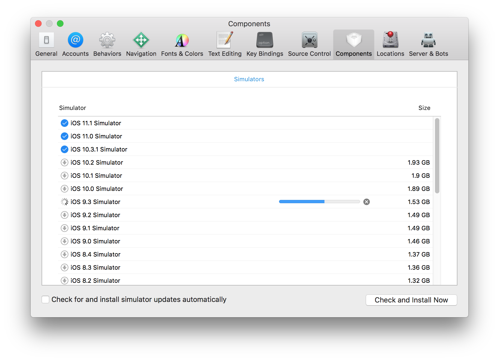

# iOS Development Guide

## Supported Browser Targets

The goal is to have full coverage against all modern iOS versions against all devices; however, we select a reasonable subset which we believe will have a high likelihood of full interoperability across modern devices.

The following iOS versions and devices are targeted.

iOS Versions

* iOS 9.3
* iOS 10.3
* iOS 11.1

Device Targets

* iPhone 7
* iPad 5th Generation

## Development Setup Overview

### Mac OSX

To work on Slate with iOS, we recommend using a software program on the Mac by Apple called Simulator. Simulator allows you to emulate different iOS devices and different versions of iOS on a Mac.

### Windows or Linux

We do not currently have instructions on developing for iOS using Windows or Linux.

## Steps for Developing on iOS with a Mac

* Setup
  * Install Xcode
  * Open Xcode
  * Open Simulator
  * Pin Simulator to Dock \(recommended\)
  * Add more iOS versions
* Development
  * Open Simulator
  * IMPORTANT! Disconnect Hardware Keyboard in Simulator
  * Debugging in Mac Safari with Simulator
  * Tips and Tricks

## Setup

### Install Xcode

Simulator is part of Xcode so you will need to install Xcode to get access to Simulator.

If you don't have Xcode installed already, install it now by following these instruction.

* From your Mac, open the **App Store**. One way to do this is to type `CMD+SPACE` to open Spotlight then type `app store`. 
* From the **App Store** window, type `xcode` in the search box near the top of the window.
* In the search results, you will see **Xcode**. Next to **Xcode**, there is a button that says **GET**. Click the button. Do not click the drop-down arrow.
* The word **GET** will change to **INSTALL APP**. Click this button.
* You will need to enter your **Apple ID** and **Password** to continue with the installation.
* The button will read **INSTALLING** during the installation process.

### Open Xcode

To start using simulator, first open Xcode:

* Clicking the `OPEN` button from the Search Results in the app store \(as shown in the previous screenshot under **Install Xcode**\)
* If you already had Xcode installed or have closed that window, you can type `CMD+SPACE` to open **Spotlight** and then type `xcode` and select it \(see screenshot below\)

NOTE: You will be required to enter your password the first time you use Xcode in order to continue.

### Open Simulator from Xcode

To open Simulator from Xcode

* Open the **Xcode** menu
* Select the **Open Developer Tool** submenu
* Select **Simulator**

Once you open **Simulator** from **Xcode** it will open a default device with a default iOS version. The device/version at time of writing is the iPhone X at iOS version 11.2.

### Pin Simulator to Dock \(Recommended\)

We recommend pinning Simulator to the Dock so that it is easier to access. By pinning, you don't have to open **Xcode** in order to run **Simulator**.

To Pin Simulator

* `CTRL-click` or `RIGHT-click` Simulator in the Dock.
* Select **Options**
* Select **Keep in Dock**

### Add More iOS Versions

By default, Simulator doesn't install every iOS version. Follow these instructions to install older iOS versions in order to support our browser targets.

* Open **Xcode** \(follow the instructions under the heading Open Xcode earlier in this document if you are unsure how\)
* From the **Xcode** menu select **Preferences...**

* Open the Components tab and select the iOS Simulator versions to install. Our current iOS targets are:
  * iOS 11.1 Simulator
  * iOS 10.3 Simulator \(shown as 10.3.1\)
  * iOS 9.3 Simulator

## Development

### Open Simulator

When starting a development session on iOS, you must first open the Simulator.

* If you followed the instructions in **Pin Simulator to Dock** above, then you can open Simulator by clicking the **Simulator** icon in your dock.
* You may also be able to open simulator by clicking `CMD+SPACE` to open **Spotlight** and typing `simulator` and selecting it if it shows up. It may not be recognized in your system yet so this might not work immediately.
* If you haven't pinned **Simulator** and it doesn't open using **Spotlight**, you will have to open it from **Xcode**. Follow the instructions under the heading **Open Simulator from Xcode **above in the **Setup** section.

### Start a Device in Simulator

To start a Device:

* Click the **Hardware** menu
* Select the **Device** sub-menu
* Select the iOS version you wish to start \(try iOS 11.2 to start\)
* Select the specific device \(try iPhone 8 to start\)

After starting the device, you will see a working simulation of the device on the screen.

Open the Safari app on the device by clicking the Safari icon \(it's the blue circle that looks like a compass in the lower left of the screen\).

Once Safari is open, enter the URL you wish to work on. For now, try entering `slatejs.org` to visite the Slate Examples page on the Internet.

### IMPORTANT! Disconnect Hardware Keyboard

In order to test iOS with Slate, you must disconnect the hardware keyboard.

> If you do not do this, the virtual keyboard that usually appears on iOS when you are editing will not appear. iOS will behave as if a hardware keyboard has been attached to the device.
>
> It is important to display the virtual keyboard because some important bugs and edge cases do not present themselves when a hardware keyboard is attached.

To disconnect the hardware keyboard in Simulator

* Open the **Hardware** menu
* Select **Keyboard** from the sub-menu
* Make sure **Connect Hardware Keyboard** is unchecked
* If it is checked \(like in the screenshot below\) then click it to toggle it off.
* If it is already unchecked, then exit the menu.

You can confirm that you have successfully disconnected the hardware keyboard by clicking in the editor from the SlateJS Examples site at http://slatejs.org. You should see the virtual keyboard appear as in the screenshot below.

### Debugging in Mac Safari with Simulator

By itself, the Simulator will not show you any debug information.

To get access to the console and use other debugging tools, open Safari on your Mac. Note that this is not Safari on your iOS device which you have already opened.

The easiest way to open Safari on your Mac is one of these two ways

* Type `CMD+SPACE` to open **Spotlight** and type `safari`.
* Click the **Safari** icon that is probably in your Dock which is probably at the bottom of your screen

Once you have **Mac Safari** open, you can use it to debug **iOS Safari** in the Simulator.

* From the **Mac Safari** menu, select **Develop**
* Select **Simulator**
* Select the iOS Safari session you want to debug. In the screenshot below, I've selected **slatejs.org**.
* This will open up Web Inspector for that session which will give you many debugging tools.

Once you've opened up Web Inspector, you will see a screen like this

### Tips and Tricks

There are a few tips and tricks that I've found useful.

* Use `CMD+LEFT` and `CMD+RIGHT` to rotate the device in Simulator. Useful for testing in both horizontal and vertical orientation.
* If you need to enter a URL into Safari in Simulator, you can `COPY` the URL from any Mac program. Click in the address bar in Safari in the Simulator and then select `PASTE`. This can save you time from typing long URLs using the virtual keyboard.

