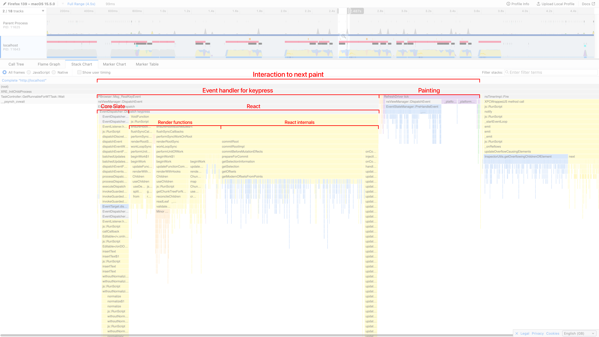

# Improving Performance

When building a text editor, it's important for user interactions to take place without any noticeable delay. For small and moderately sized documents (less than 1000 blocks), you probably don't need to worry about performance. If your editor needs to support very large documents (10,000+ or 100,000+ blocks), follow this guide to ensure the editor stays responsive.

The [Huge Document](https://slatejs.org/examples/huge-document) example contains an interactive playground where you can explore the effect of various factors on the performance of a very simple Slate editor.

The type of performance this guide is mostly concerned with is the **Interaction to Next Paint** (INP) while typing. If the INP is below roughly 100ms, typing should feel very responsive. The editor will still be usable when the INP duration is longer, but it will feel increasingly sluggish and unpleasant to use.

Other performance metrics to be aware of (but which are not currently covered in this guide) are **time to first paint** and the INP when performing non-typing operations (such as selecting all content or pasting).

INP is easiest to measure in Chrome using the [Performance panel](https://developer.chrome.com/docs/devtools/performance) in DevTools, but there are ways to determine it in Firefox and Safari too. For example, in Firefox, you can use the [Firefox Profiler](https://profiler.firefox.com/) to see a timeline of events.



There are three main areas that can be optimized:

- [Slate core](#optimizing-slate-core)
- [React](#optimizing-react)
- [DOM painting](#optimizing-dom-painting)

Before you start optimizing, make sure you know which of these areas is most responsible for any slowness you're seeing. The best way of doing this is to use your browser's profiler (see the example for Firefox above), but you can also use these heuristics to guess which area is most at fault:

1. If performance is much better in Firefox than in Chrome or Safari, DOM painting is usually the problem (tested May 2025).
2. If disabling any custom normalization logic improves performance, the normalization logic is the problem.
3. Otherwise, it's likely to be React.

## Optimizing Slate Core

Usually, if the core Slate logic is causing a noticeable delay, it's because of [normalizing](../concepts/11-normalizing.md). If custom normalization logic is causing slowness in your app, consider whether the logic can be made more efficient.

Understand that `normalizeNode` is called once for every modified node and every ancestor of a modified node. As a result, `normalizeNode` is called for the editor node whenever anything changes in the editor, but for other nodes it is called much less frequently.

Make sure you only normalize the node passed into `normalizeNode` and (occasionally) its direct children, not its children's descendants. Normalization logic should only be applied directly to the editor node when absolutely necessary, such when enforcing that the last block in the document is a paragraph.

## Optimizing React

### Reduce Renders

The `renderElement` prop and any React component it returns will re-render every time the element or any of its descendants changes. This is unavoidable. However, sometimes custom logic can cause React components to re-render more often than this, which can have a detrimental effect on performance.

Ensure that function props such as `renderElement`, `renderLeaf`, `renderChunk` and `decorate` do not change on every render. Either they should be defined at the top level of the file (not inside a component or hook), or they should be wrapped inside a `useCallback` and all dependencies should be properly memoized.

If unmodified elements are being re-rendered, check to see if they are subscribing to any contexts or hooks that are causing unnecessary re-renders. You can also apply these techniques to any toolbars or other non-element React components that may be re-rendering in response to changes in the editor.

The `useSlate`, `useSlateSelection`, `useSlateSelector`, `useSelected` and `useFocused` hooks cause React components to re-render in various circumstances. If you're using `useSlate`, consider if you can use `useSlateStatic` (which does not cause re-renders) instead. If you're using `useSlateSelection`, consider using `editor.selection`. If you only care about some value derived from the editor (such as whether a given mark is active), use `useSlateSelector` to only re-render when this value changes.

If your components depend on custom React contexts containing non-primitive values (such as objects or arrays), ensure that these values are properly memoized so that components only re-render when these values change. In some circumstances, you may instead want to consider passing a ref object or an unchanging getter function to retrieve the latest value.

```tsx
// Provider
const myDataRef = useRef(myData)
myDataRef.current = myData
return <MyContext.Provider value={myDataRef}>{children}</MyContext.Provider>

// Consumer
// Does not re-render when `myData` changes
const myDataRef = useContext(MyContext)

const onClick = () => {
  console.log(myDataRef.current)
}
```

### Enable Chunking (experimental)

Chunking is an internal optimization used by `slate-react`, and must be explicitly enabled. It works by splitting a node's children into nested "chunks", each of which is a separately memoized React component. This reduces the amount of work React needs to do when processing changes to the JSX, resulting in a 10x speed-up in ideal circumstances.

To enable chunking, you need to implement `editor.getChunkSize(node: Ancestor) => number | null`, which controls the number of nodes per lowest-level chunk for a given parent node. In most circumstances, setting the chunk size to 1000 for the editor and `null` for all other ancestors works well.

```typescript
editor.getChunkSize = node => (Editor.isEditor(node) ? 1000 : null)
```

Note that chunking can only be enabled for nodes whose children are all block elements. Attempting to enable chunking for leaf blocks (blocks containing inline nodes) will have no effect.

By default, chunking has no effect on the DOM. You can override this by passing a `renderChunk` prop to `Editable`.

## Optimizing DOM Painting

In Chrome and Safari, painting large numbers of DOM nodes can be extremely slow, over 100x slower than the core Slate logic and React rendering combined in some cases. In Firefox, the impact of painting on performance is much less significant.

The best way of speeding up painting large documents is to use the [`content-visibility`](https://developer.mozilla.org/en-US/docs/Web/CSS/content-visibility) CSS property. When set to `auto`, this property instructs browsers not to paint content that is off-screen. However, it also comes with a performance overhead proportional to the number of DOM nodes it is applied to, which is especially bad in Safari. When rendering large documents in Safari, applying `content-visibility: auto` to each Slate element individually is often slower than not using it at all.

The recommended solution is to enable [chunking](#enable-chunking-experimental) and apply `content-visibility: auto` on each lowest-level chunk by passing a `renderChunk` prop to `Editable`.

```tsx
const renderChunk = ({ attributes, lowest, children }: RenderChunkProps) => (
  <div
    {...attributes}
    style={lowest ? { contentVisibility: 'auto' } : undefined}
  >
    {children}
  </div>
)
```

Note that this will modify the DOM structure of your editor, which may have adverse effects on its appearance. During development, it is recommended to set the chunk size to a small number such as 3 so that styling issues caused by nested chunks are easier to detect.

If you previously had a CSS rule such as this to apply spacing between top-level blocks:

```css
[data-slate-editor] > * + * {
  margin-top: 1em;
}
```

It should be changed to this:

```css
[data-slate-editor] > * + *,
[data-slate-chunk] > * + * {
  margin-top: 1em;
}
```

Also bear in mind this warning about `content-visibility: auto` from MDN:

> Since styles for off-screen content are not rendered, elements intentionally hidden with `display: none` or `visibility: hidden` _will still appear in the accessibility tree_. If you don't want an element to appear in the accessibility tree, use `aria-hidden="true"`.
