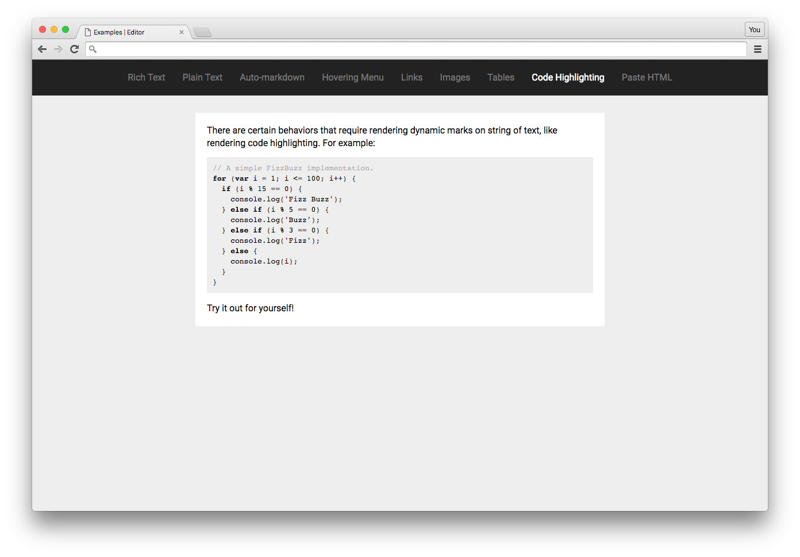

# Code Highlighting Example

This example shows you how to use "decorators" to render dynamically formatted text—in this case, code blocks!

Check out the [Examples readme](..) to see how to run it!
