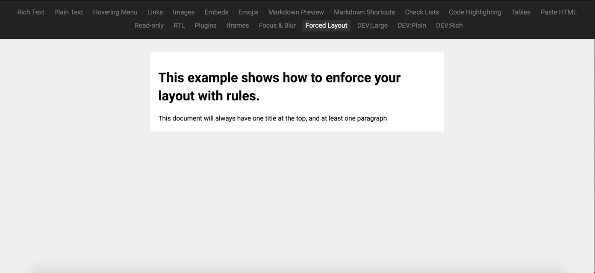

# Forced Layout Example

This example shows you how you can use Rules in your schema to enforce a document structure.  The basic example enforces having one title block that is always at the top, and at least one paragraph block underneath it.

Check out the [Examples readme](..) to see how to run it!
