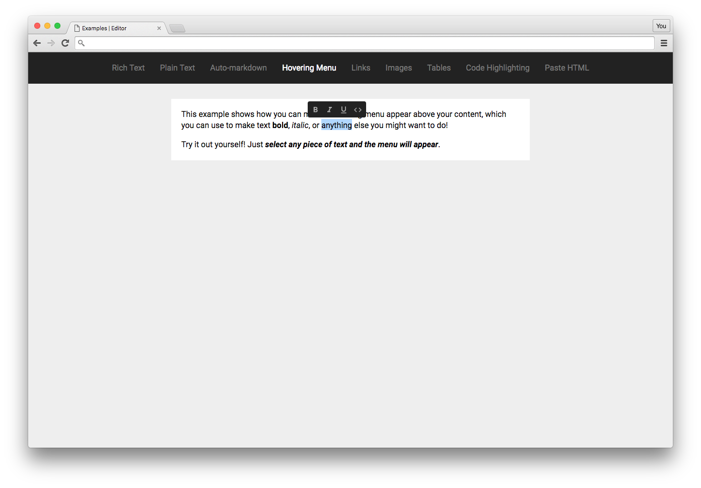

# Hovering Menu Example

This example shows you add a menu that appears hovering above the current selection as a user clicks around, where you can add formatting buttons. The menu is its own React component, completely separate from Slate, but the buttons in it are wired up to change the content in Slate's editor.

Check out the [Examples readme](..) to see how to run it!
