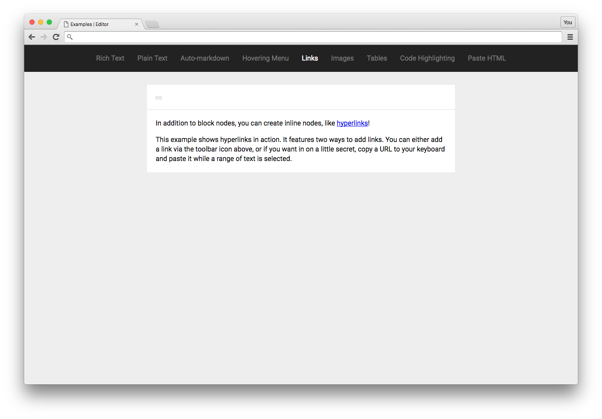

# Links Example

This example shows you how you can wrap text in "inline" nodes to associate metadata, like an `href`, with a piece of text. This is how you'd add links to Slate, but it's also how you might add hashtags, at-mentions, and many more inline features!

Check out the [Examples readme](..) to see how to run it!
