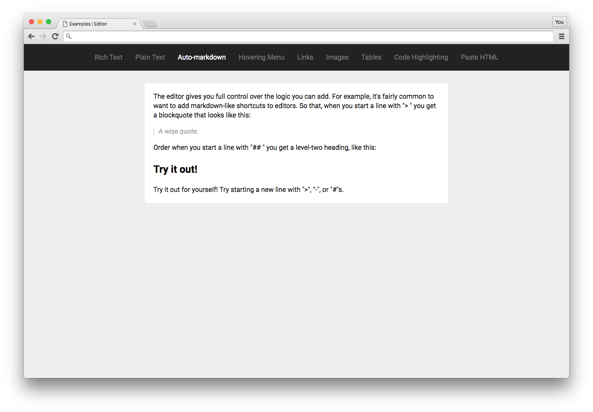

# Auto-markdown Example

This example shows you can add a few key command handlers to get Markdown-like shortcuts in the editor. Such that once you press `> ` at the start of a line it turns it into a block quote!

Check out the [Examples readme](..) to see how to run it!
