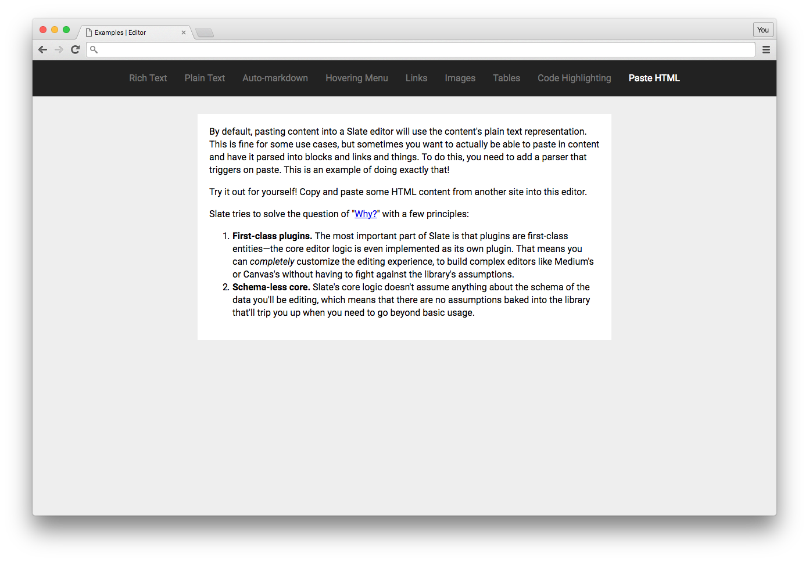

# Paste HTML Example

This example shows you how you can use the HTML serializer to convert HTML that a user pastes into the editor into formatted text, instead of it defaulting to plain text.

Check out the [Examples readme](..) to see how to run it!
