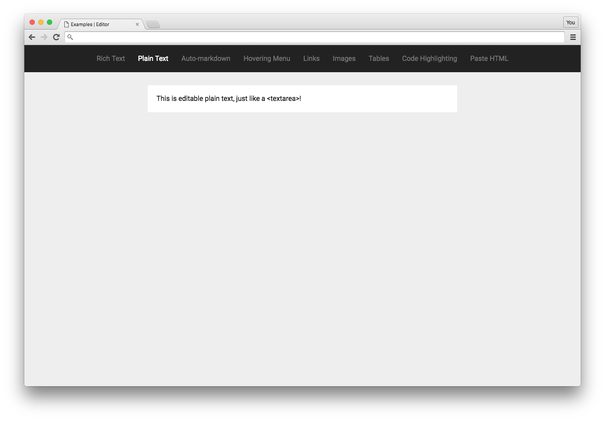

# Plain Text Example

This is the most basic Slate example. It's basically a glorified `<textarea>`. But it gives you a sense for the absolute basics of Slate.

Check out the [Examples readme](..) to see how to run it!
