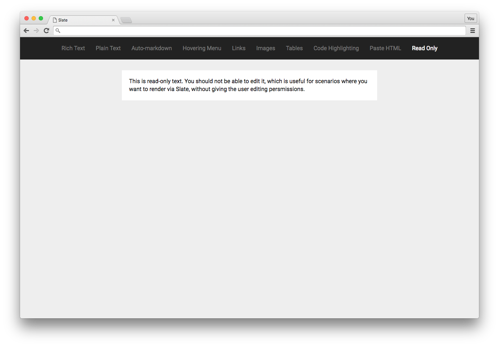

# Read-only Example

This example shows how you can render Slate in "read-only" mode, where the user can still see the document exactly as it would normal be rendered, but they cannot edit the content in any way. This is useful for cases where the user has "see" persmissions but not "edit" permissions.

Check out the [Examples readme](..) to see how to run it!
