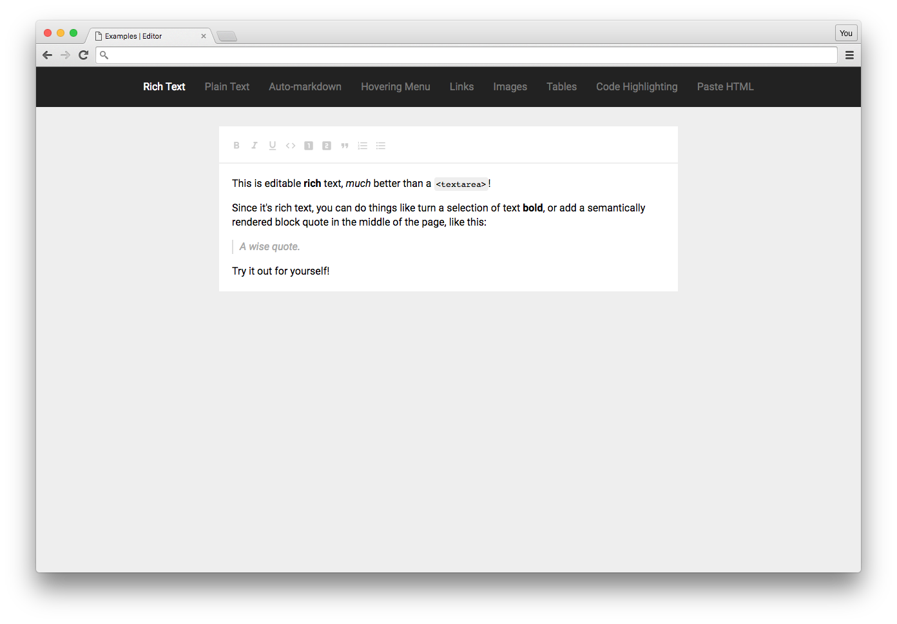

# Rich Text Example

This example shows you can add a very different concepts together: key commands, toolbars, and custom formatting, to get the functionality you'd expect from a rich text editor. Of course this is just the beginning, you can layer in whatever other behaviors you want!

Check out the [Examples readme](..) to see how to run it!
